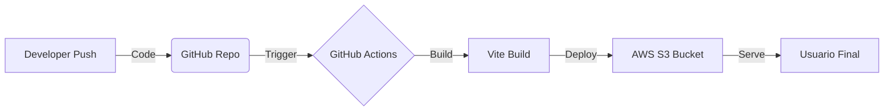

# 🚀 Portafolio Profesional & Cloud Resume


> **Ing. Roberth Rios Jesus** - Ingeniero de Sistemas Colegiado (CIP 321353)

Este repositorio aloja el código fuente de mi portafolio profesional, diseñado como una aplicación web moderna y desplegado utilizando una arquitectura **Serverless** en AWS. Este proyecto demuestra competencias en desarrollo Fullstack y prácticas de DevOps.

## 📋 Características

- **Diseño Responsivo:** UI moderna adaptada a móviles y escritorio utilizando **Tailwind CSS**.
- **Animaciones Fluidas:** Interacciones y transiciones suaves con **Framer Motion**.
- **Arquitectura Cloud:** Alojamiento estático de alto rendimiento en **Amazon S3**.
- **CI/CD Automatizado:** Pipeline de integración y despliegue continuo mediante **GitHub Actions**.
- **Datos Dinámicos:** La información del perfil se carga desde un archivo JSON para facilitar actualizaciones sin tocar la lógica de los componentes.
- **Descarga de CV:** Funcionalidad integrada para descargar el hoja de vida en PDF.

## 🛠️ Stack Tecnológico

### Frontend
- **React.js:** Librería principal para la construcción de interfaces.
- **Vite:** Herramienta de construcción (bundler) ultra rápida.
- **Tailwind CSS:** Framework de utilidades para el estilizado.
- **Framer Motion:** Librería para animaciones de producción.
- **Lucide React:** Iconografía ligera y moderna.

### Infraestructura & DevOps
- **AWS S3:** Almacenamiento de objetos para hosting de sitio estático.
- **GitHub Actions:** Orquestación del flujo de trabajo para build y deploy automático al realizar un push a la rama `main`.

## 🏗️ Arquitectura de Despliegue



## 🚀 Instalación y Uso Local

Si deseas clonar y ejecutar este proyecto localmente:

1. **Clonar el repositorio:**
```bash
git clone https://github.com/Roberthrjr/portfolio-roberth.git
cd portfolio-roberth

```


2. **Instalar dependencias:**
```bash
npm install

```


3. **Ejecutar servidor de desarrollo:**
```bash
npm run dev

```


4. **Construir para producción:**
```bash
npm run build

```


## 📂 Estructura del Proyecto

```text
/
├── public/             # Archivos estáticos (favicon, CV.pdf, foto.png)
├── src/
│   ├── data/           # Datos del perfil (profile.json)
│   ├── App.jsx         # Componente principal
│   ├── index.css       # Estilos globales y directivas Tailwind
│   └── main.jsx        # Punto de entrada
├── .github/workflows/  # Configuración de CI/CD (deploy.yml)
└── vite.config.js      # Configuración de Vite

```

## 📬 Contacto

Si tienes alguna pregunta sobre el proyecto o deseas contactarme por motivos profesionales:

* **LinkedIn:** [Roberth Rios Jesus](https://linkedin.com/in/roberthrjr)
* **GitHub:** [Roberthrjr](https://github.com/Roberthrjr)
* **Email:** tauroroberth00@gmail.com

---

© 2025 Roberth Rios Jesus. Desarrollado con ❤️ y desplegado en la Nube.
